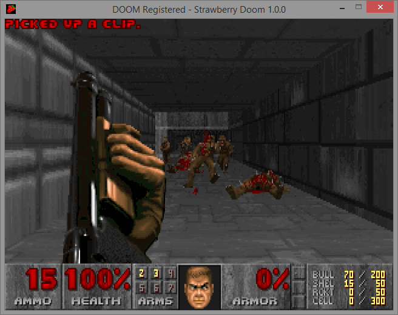

# Mirror of Strawberry Doom


**[Strawberry Doom](https://www.chocolate-doom.org/wiki/index.php/Strawberry_Doom)** is a fork of the Chocolate Doom codebase that extends some of the limits of Chocolate Doom to match some of those of [PrDoom+](https://doomwiki.org/wiki/PrBoom%2B), as well as adding features such as playable bots, despite of this, the port now seems to be defunct, as it was last updated in March of 2008 and _never actually_ saw an official release by the head developer, [GhostlyDeath](https://doomwiki.org/wiki/RestlessRodent) (who is now known as RestlessRodent), only playable demos were released via the project's [SourceForge page](https://sourceforge.net/projects/doomsvnbuilds/files/Strawberry%20Doom/), that this is a mirror of.

It featured extended limits as per Doom plus, in-game multiplayer scoreboard which also shows player health and armor information, enhanced and color contextualized automap (which was also copied into [ReMooD](https://doomwiki.org/wiki/ReMooD), a port that GhostlyDeath would soon work on a few months later), primitive bots with primitive navigation for any level, and [deathmatch team support](https://www.chocolate-doom.org/wiki/index.php/Multiplayer). 

## Versions in this repository
This repository is made-up of all of the known versions of the port that have been published to-date. In total, 21 of the published versions do not have any type of README file attached and 3 versions have READMEs that are simply just the dash (-) 73 times, effectively making the help files useless to even look at.

> **Strawberry Doom version r1020 (strawberry-doom-r1020-win32)**

As seemly dated 2007-07-20, this is the first known version of the port to be published. The file that the EXE for the port comes in has a rather lacklustre README file giving the date, version, and seemly a credit to [Simon "fraggle" Howard](https://doomwiki.org/wiki/Simon_Howard_(Fraggle&#x29;), despite him having nothing to do with the making of this port. Oddly, despite saying that it is dated 2008-01-25 in the README, none of the files share that date, with the oldest being from 2007-07-20 and the newest from 2008-02-02.

> **Strawberry Doom version r1021 (strawberry-doom-r1021-win32)**

As dated 2008-01-25, this version also has a rather empty README, with the main body saying "Renamed alot of chocolate-doom to strawberry-doom".

> **Strawberry Doom version r1023 (strawberry-doom-r1023-win32)**

This version of the port sets the trend of not having a README file in the ZIP.

> **Strawberry Doom version r1025 (strawberry-doom-r1025-win32)**

This version has no README file.

> **Strawberry Doom version r1032 (strawberry-doom-r1032-win32)**

This version has no README file.

> **Strawberry Doom version r1033 (strawberry-doom-r1033-win32)**

This version has no README file.

> **Strawberry Doom version r1034 (strawberry-doom-r1034-win32)**

This version has no README file.

> **Strawberry Doom version r1037 (strawberry-doom-r1037-win32)**

Version r1037 _does_ have a README file, but despite of this, it is rather empty, not saying all that much;

```
------------------------------------------------------------------------
r1037 | rtc_marine | 2008-02-01 00:38:26 +0200 | 1 line

Merge changes from chocolate-doom
------------------------------------------------------------------------
```

> **Strawberry Doom version r1039 (strawberry-doom-r1039-win32)**

Yes, version r1039 has a README file, although it's really not helpful _at all_ as it is just the dash (-) 73 times, effectively making it useless to even look at.

> **Strawberry Doom version r1040 (strawberry-doom-r1040-win32)**

Unlike past versions, we have a full source dump of the port. By looking through it, it soon becomes clear that it is mostly a copy of the Chocolate Doom port's source, this can be seen in the `README` file, that has the opening line of "Chocolate Doom is a Doom source port which aims to behave as closely as possible to the original DOS Doom executables".

The source was found via [AXDOOMER's GitHub](https://github.com/AXDOOMER/strawberry-doom/releases/tag/r1040).

> **Strawberry Doom version r1041 (strawberry-doom-r1041-win32)**

This version has a README, but it is the same as r1039.

> **Strawberry Doom version r1047 (strawberry-doom-r1047-win32)**

This version has no README file.

> **Strawberry Doom version r1054 (strawberry-doom-r1054-win32)**

This version has no README file.

> **Strawberry Doom version r1058 (strawberry-doom-r1058-win32)**

This version has no README file.

> **Strawberry Doom version r1059 (strawberry-doom-r1059-win32)**

This version has no README file.

> **Strawberry Doom version r1060 (strawberry-doom-r1060-win32)**

This version has no README file.

> **Strawberry Doom version r1061 (strawberry-doom-r1061-win32)**

This version has no README file.

> **Strawberry Doom version r1062 (strawberry-doom-r1062-win32)**

This version has no README file.

> **Strawberry Doom version r1063 (strawberry-doom-r1063-win32)**

This version has no README file.

> **Strawberry Doom version r1064 (strawberry-doom-r1064-win32)**

This version has no README file.

> **Strawberry Doom version r1070 (strawberry-doom-r1070-win32)**

This version has no README file.

> **Strawberry Doom version r1071 (strawberry-doom-r1071-win32)**

This version has no README file.

> **Strawberry Doom version r1075 (strawberry-doom-r1075-win32)**

This version has no README file.

> **Strawberry Doom version r1077 (strawberry-doom-r1077-win32)**

This version has no README file.

> **Strawberry Doom version r1078 (strawberry-doom-r1078-win32)**

This version has no README file.

> **Strawberry Doom version r1079 (strawberry-doom-r1079-win32)**

This version has no README file.

> **Strawberry Doom version r1080 (strawberry-doom-r1080-win32)**

This version has no README file.

> **Strawberry Doom version r1099 (strawberry-doom-r1099-win32)**

This version has no README file.

> **Strawberry Doom version r1100 (strawberry-doom-r1100-win32)**

After 17 versions of no README files, this one _finally_ has one and much like past versions, it is small and doesn't convey all that much information.

```
------------------------------------------------------------------------
r1100 | GhostlyDeath | 2008-03-01 00:53:57 +0200 | 1 line

Bots will no longer go into an all out deathmatch if they accidently shoot each other in Coop; Bots will now try not to blow out the backs of other players in coop and team dm
------------------------------------------------------------------------
```

> **Strawberry Doom version r1101 (strawberry-doom-r1101-win32)**

This is the final publicly known version of the port to have been published on the project's [SourceForge page](https://sourceforge.net/projects/doomsvnbuilds/files/Strawberry%20Doom/).

Unlike a lot of past versions, this one _does_ have a README file attached along with it, although it is as short as the rest, simply saying when it was published (2008-03-01) and a comment saying "Bots will no longer try grabbing items that are too high or too low when their Z position changes".

The folder that holds this version also has `strawberry-doom-r1101.zip` and `strawberry-doom-r1101.tar.gz` that contain the full source for the port, sadly, much like other versions with the source in, there's really not much to show-off. There is a file called `AUTHORS` that has this in;

```
Simon Howard <[REMOVED E-MAIL]>
Steven "GhostlyDeath" G <ghostlydeath.com>
```

Looking up [hostlydeath.com](http://www.ghostlydeath.com/), you will see that it is off-line and sadly, by posting in the URL on [The Internet Archive](https://web.archive.org), you will find that [non of the site was archived at all](https://web.archive.org/web/*/http://ghostlydeath.com/*).

The source code was found via [AXDOOMER's GitHub](https://github.com/AXDOOMER/strawberry-doom/releases/tag/r1101).

> **Strawberry Doom version r1188 (strawberry-doom-r1188-win32)**

For some reason, this version is not listed the project's [SourceForge page](https://sourceforge.net/projects/doomsvnbuilds/files/Strawberry%20Doom/), but found via [AXDOOMER's GitHub](https://github.com/AXDOOMER/strawberry-doom/releases/tag/r1188), this is the last known version of the port that was seemly made. Much like past versions of the port, this version does not come with a README file.

What makes this version unique (apart form being the last version) is that unlike past issues, a batch file is included, `setup.bat`;

```
@echo off
copy /y "*.cfg" "%USERPROFILE%\.strawberry-doom\*.cfg" > nul 2>&1
strawberry-setup
copy /y "%USERPROFILE%\.strawberry-doom\*.cfg" "*.cfg" > nul 2>&1
```

# Disclaimer Regarding This Project
Just because I have mirrored a project by another person, this **does not mean** in anyway, shape, or form that I agree or support the views of this project or even the person who made it, I have simply mirrored it for historical reasons as I have an interest in digital preservation. Over the years I have taken the time in archiving many items, much of which can be seen [on my Internet Archive user page](https://archive.org/details/@14jammar). Following this, just because I have mirrored a project, this also does not mean that the author endorses me or my work.

If you are reading this and are wondering why exactly [that this disclaimer](https://github.com/DynTylluan/disclaimer) is inside of this project, it is simply here as a blanket way for getting out of trouble if myself or the project owner gets into hot water in some way, just in case. This is a standard document that is in all of [my GitHub](https://github.com/DynTylluan/) mirrors and _does not automatically_ mean that the project owner is a bad person or to be untrusted.

You are welcome to delete this file, as it will not affect the main part of the project in anyway.

> Cass Python of [owlman.neocities.org](https://owlman.neocities.org)